# Introducción
 Seamos geógrafos o aspirantes a serlo, es importante conocer las características físicas de una cuenca de drenaje, las cuales revisten gran importancia para la realización de estudios geomorfológicos, hidrológicos y geotécnicos, ya que influyen en el desarrollo de múltiples procesos fluviales y en el riesgo de inundación morfometría de cuenca. Si bien es cierto que cada vez que se hace un estudio de este tipo o relacionado a este, es en cierto sentido intermiable por la poca informacion ofrecida por las partes encargadas. [@busnelli2014morfometria], aunque en este artículo tendremos la exepción.  
  
 La cuenca el río Soco es una de las mas importantes en el este de dicho pais, la cual comprende desde la parte norte de la región este hasta la parte sur de dicha región, políticamente comenzando desde la Provincia de El Seibo y la Provincia de Hato Mayor del rey, en las zonas muy forestales y altas de la cordillera del Seibo (cordillera Oriental), y dicha cuenca sera el punto de concentración de nuestra investigación. Posee una forma en cierto sentido pensando el punto de desemboque.

  Reivindicar la geomorfología, es decir, los procesos y formas abióticos, en este caso, como valor en sí mismo del sistema fluvial y como clave de conservación y restauración constituye una innovación en nuestro país, donde el desconocimiento geomorfológico en el ámbito ambiental es muy grave, donde muchas veces la geomorfología no se considera (como ocurre en muchos estudios de impacto) y no es que se infravalore, sino que directamente no existe o se desprecia. [@ollero2011innovacion]. 
  
  Lo que vemos en este análisis morfométrico fluvial son datos provocados de fuentes de código libre, realizandose en el Soco para  hallazgos y  contribuciones a la ciencia con mas información útil compartida, ya sea el primer trabajo de esta area geomorfológoica o no.
   
   Imporante a tomar en cuenta que el concepto de Horton-Strahler ha sido importante en la geomorfología de las cuencas fluviales; describe propiedades de escala e identifica GIUH, pero también ha atraído críticas, porque depende del área de umbral S, que se utiliza para extraer la red de canales de los modelos digitales de elevación (MDE), de la posición de la salida y del escaso número de ratios utilizados para identificar las leyes de escala. Para superar estas limitaciones, este artículo propone nuevos índices independientes de S y que tienen propiedades similares a las relaciones de Horton-Strahler.[@moussa2009definition].

  La geomorfología regional, definida como ciencia que se ocupa de describir y explicar la distribución espacial de las formas del terreno a escala regional y subregional, ha sido considerada por la planificación física y la ordenación del territorio más clásicas, como la única disciplina capaz de analizar las “líneas maestras” que definen el carácter complejo del territorio y del paisaje. 

  La utilización del relieve como base física para la delimitación y definición de unidades territoriales integradas, básicas para gestionar el territorio y sus recursos, ha constituido además uno de los métodos tradicionalmente empleados por algunas de las disciplinas ambientales que en mayor medida han contribuido al acercamiento de la planificación física clásica hacia la nueva ordenación integral; es el caso de la Ecología del  Paisaje, la Ecología Humana y la Geografía Ambiental.[@munoz2009geomorfologia].

  Este trabajo se centra en la cuenca del soco, como objetivo: su morfometría, tantos aspectos sean conocidos, realizado con apoyo de softwares libres y scripts adaptados al área de estudio, la cuenca del Soco. También, se inquiere sobre la existencia de una relación entre: los perfiles longitudinales e índice de concavidad con la litología de la cuenca; la relación entre los parámetros morfométricos con las características litológica y si hay factores que se asocien con la curva e integral hipsométricas de la cuenca.Por medio de parámetros morfométricos se busca identificar qué forma tienen la cuenca y su red de drenaje. De igual manera, se trata de comprender como se organiza la red de drenaje; y, tras el estudio de la cuenca y su red de drenaje, se indaga si se producen ciertros movimientos de reorganización en ellas.  Al realizar estas investigación nos preguntamos ¿Cual es el orden concreto de la cuenca del Soco? ¿Qué otra información obtenemos al investigar esta cuenca? ¿Podrían utilizarse sus aguas para hacer una presa o represa en ella?

# Area de Estudio

  El  presente estudio fue realizado en la cuenca del río Soco, ubicada en la zona Este de la República Dominicana, con una extensión superficial de 988.62 km2, siendo esta una de las mas grandes del pais, con forma ilustrativa a un triangulo isosceles invertido. Dicha cuenca tiene como rio principal y/o cabecera el río Soco, teniendo su nacimiento en una de las montañas de la Cordillera del Seibo, al sur de la poblacion de miches, y desembocando así en la Boca del Soco, donde termina la cuenca de análisis.
  
  Dicha cuenca pasa por Hato Mayor Del Rey (70,141 Hab) El Seibo (97,144 Hab) La Romana (139,671 Hab) y San Pedro de Macorís (217, 141). cuenca ubicada de Nor Noreste hasta Sur Suroreste, comprendiendo desde elevaciónes superiores de la cordillera del Seibo hasta la Llanura costera del caribe, Vertiendo sus aguas en el mar caribe.
  
# Metodología 
  Para la realización de estas operaciones se utilizaron operaciones de análisis morfométrico de redes de drenaje y cuenca de los paquetes de software de código abierto GRASS GIS, utilizando como medio de interpretación y organización cuantitativa y/o cualitativa de información R como entorno de programación [@allaire2012rstudio] implementado y desglosado en la computadora de uso familiar. 
  
Lo utilizado para la caputura de resultados fue de varios addons, y apertura de mapas y análisis en R, donde se hizo de los mismos para asi extraer resultados, creando primero una región donde se guardaron los datos recogidos en el analisis de la cuenca, uso el cual se le dió en orden de metodos.

  Dentro de GRASS GIS fueron utilizados otros paquetes para la óptima comprensión de datos, con la utilización de un modelo digital de elevacion (para lo siguiente, MDE) de la misión radar del transbordador espacia Shuttle [@lemos2004avaliaccao], con altura aproximada a 90 metros para la extracción de información requiriente.

Para extraer la cuenca se utilizó el addon r.water.outlet [@lozar2003geographic], usado también el addon r.vect, lo que llevó a convertir el raster resultante en vectorial, para así colocacarlo en R. De igual forma se aplicó el addon r.stream.extract [@jasiewicz2011new], para lograr extraer la red de drenaje donde se llevaron a R los resultados del mismo.
  
   En la acumulación de flujo, los parámetros de cuenca del mismo, como elevación, drenaje, y otros más, fueron calculados a través del addon de GRASS GIS  r.watershed [@lozar2003geographic], contando con un umbral acumulado de 82 celdas, en un MDE. Las capas generadas se ingresaron a R al junto de la libreria ap y al igual manejo con la libreria raster
   Por consiguiente, en la orden de red y el análisis hortoniano, se puso en uso el addon       r.stream.extract para producir un mapa de dirección de flujo. Por otra parte, para la creación de mapas de ordenes de red se uso el addon r.stream.order [@jasiewicz2011new], en el cual se usó la clasificación de de Strahler para el analisis de red de dicha cuenca.  
  
  Se utilizaron de igual forma los addons r.info para extraer los valores máximos y mínimos del orden de red segun Strahler partiendo de un raster, delimitada la cuenca a traves de la red de drenaje con r.stream.basins [@jasiewicz2011new]. Para el uso de estadostocas según orden de red de Horton para las redes de Strahler y Horton, se utilizó el addon r.stream.stats [@jasiewicz2011new] en resumen de las estadísticas.
  
  Luego de la creación de una nueva región de GRASS en R, se llevaron a números enteros la extensión y la resolución del DEM con las funciones integerextent y xyvector (José Ramón Martínez Batlle, 2018). También se llegó a utilizar la herramienta gdalwarp [@warmerdam2005gdal] para extraer la sesión de GRASS. se usó el addon r.stream.extract, para generar la red de drenaje y obtener las coordenadas que mas adelante seria convetrtidas a  EPGS:4326 [@jain2003adding], como números enteros con la función my_trans. (José Ramón Martínez Batlle, 2020) 
  
  Mientras que, para la obtención de los parámetros morfométricos de la cuenca se utilizó el addon r.basin [@di2013open]. Los vectores obtenidos son transformados a EPGS:4326 [@jain2003adding] y así siendo vistos o visualizados con la liobreria leaflet. De igual forma, para explorar los parámetros de la cuenca fue utilizada la libreria readr.
  
 Para el cálculo de los índices de concavidad y los perfiles longitudinales, en primer lugar, se extajeron los cursos mas largos de la cuenca en cuestión a través de la función LfpNetwork, para luego emplear la función LfpProfilesConcavity, dicha función arrojó los índices de concavidad para los cursos mas largos, y así mismo, sus perfiles longitudinales.
 
  En la última parte de realización para el cálculo de la curva y la integral hipsométrica de la cuenca, en primer lugar, lo realizado fue representar las cuencas con las librerias sp y mapview; y en segundo lugar, calcular la integral y cuva hipsométrica mediante el uso de la función HypsoIntCurve (José Ramón Martínez Batlle, 2018).
  
  

# Resultados
  En este estudio realizado a la cuenca del Soco utilizando el script reproducible, revela información que facilita el análisis y comprensión de la cuenca. vierase de manera agrupada como de forma desagregada. Por consiguiente, se presentan de manera resumida, las caracteristicas morfométricas principales de la cuenca en cuestion y su red de drenaje.

  Como se muestra en la tabla abajo descrita, la cuenca del Soco tiene como área unos 988.62 km2 y un perímetro de 227.63 km, siendo esta la cuenca mas grande de la región este, esta logra alcanzar una elevación máxima de 646.96m, la elevación media siendo de 136.34m y la elevación mínima de 0.032, con uno de los relieves mas heterogeneos e irregulares antes analizados.
  
  Table: \label{tablasiete}Parámetros morfométricos de la Cuenca del Soco

| Párametros                                                  | Valores                 |
|-------------------------------------------------------------|-------------------------|
| Easting Centroid of basin                                   | 489195.00               |
| Northing Centroid of basin                                  | 2072655.00              |
| Rectangle containing basin N-W                              | ('471060', '2092680')"  |
| Rectangle containing basin S-E                              | "('513630', '2039760')" |
| Area of basin [km2]                                         | 989.801775              |
| Perimeter of basin [km]                                     | 227.636525830754        |
| Max Elevation [m s.l.m.]                                    | 646.969411439852        |
| Min Elevation [m s.l.m.]                                    | 0.0326075545062636      |
| Elevation Difference [m]                                    | 646.9368038853457       |
| Mean Elevation                                              | 136.3463                |
| Mean Slope                                                  | 4.65                    |
| Length of Directing Vector [km]                             | 33.6112628742212        |
| Prevalent Orientation [degree from north, counterclockwise] | 1.250701649253028       |
| Compactness Coefficient                                     | 6.412284389087794       |
| Circularity Ratio                                           | 0.2400347916120         |
| Topological Diameter                                        | ,120.0                  |
| Elongation Ratio                                            | 0.4103977285869175      |
| Shape Factor                                                | ,11.44258120713636      |
| "Concentration Time (Giandotti, 1934) [hr]                  | 12.561301584730437      |
| Length of Mainchannel [km]                                  | 86.501616819            |
| Mean slope of mainchannel [percent]                         | 1.0508578295624251      |
| Mean hillslope length [m]                                   | 311.9917                |
| Elevation Difference [m]                                    | 646.9368038853457       |
| Magnitudo,                                                  | 289.0                   |
| Max order (Strahler)                                        | 5                       |
| Number of streams                                           | 421                     |
| Total Stream Length [km]                                    | 815.5888                |
| First order stream frequency                                | 0.2919776538085113      |
| Drainage Density [km/km^2]                                  | 0.8239920563892704      |
| Bifurcation Ratio (Horton)                                  | 4.2453                  |
| Length Ratio (Horton)                                       | 2.4703                  |
| Area ratio (Horton)                                         | 4.6963                  |
| Slope ratio (Horton)                                        | 1.3574                  |

  
  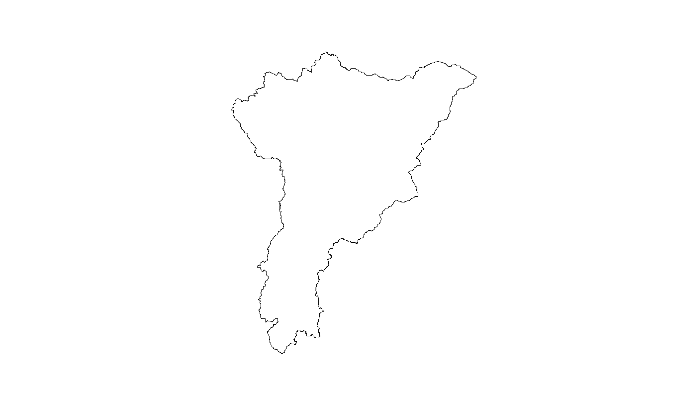 
  
   Observandose la figura la forma de la cuenca es ciertamente triangular, con la parte mas ancha en el norte y la punta de la figura en el sur con su desembocadura. Así mismo, los párametros de coeficiente de compacidad, forma de la cuenca y razón de elongación, nos dan la confirmación de la forma triangular de la cuenca en cuestión (ver tabla \ref{tablanueve}).
  Mientras que la red de drenaje de la cuenca se pueden ver drenajes acumulados y de cierta forma informales, siendo densa en ramificaciones muy regulares tal vemos en la cuenca media alta, al sur; debido a que relive se denota accidentado y a que la composición del material encontrado en la sierra del seibo, elevaciones territoriales importantes en la región y donde nace, por consiguiente, la cuenca del Soco.

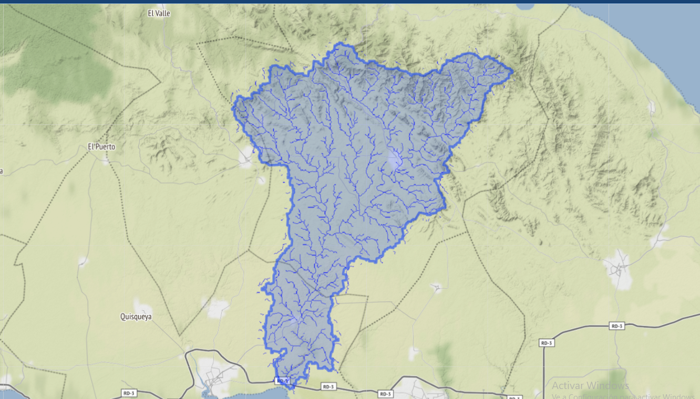{width=70%}
   
   La red de drenaje de la cuenca, Según Srahler, presenta un total de 461 redes (ver tabla \ref{tablauno}), y se organiza por ordenes desde el numero 1 hasta la numero 5 
   
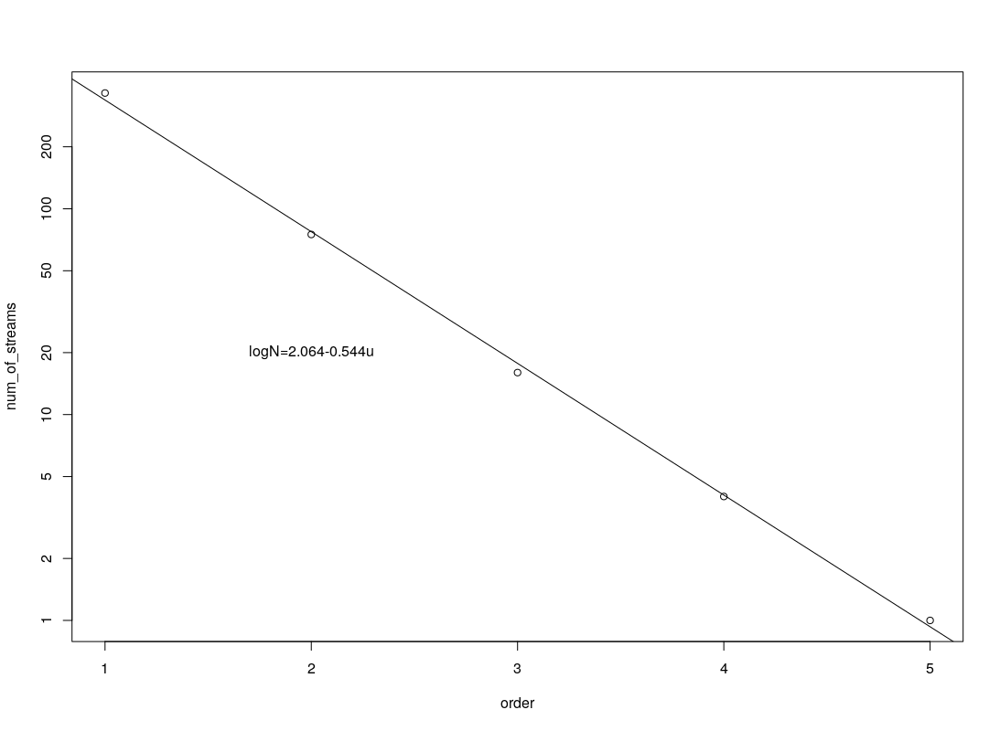{width=70%}
   

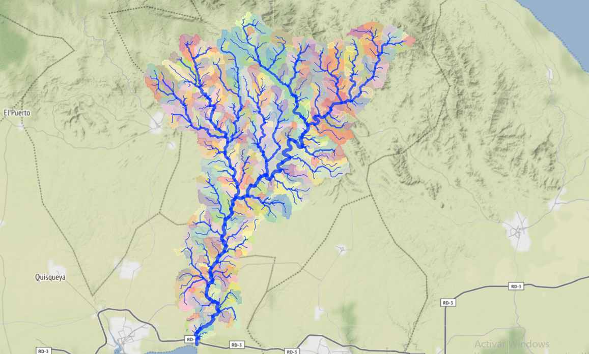{width=70%}
 
 
   Donde éstas redes de drenaje de orden uno hasta orden cinco organizados de forma concatenada, van dando como afluentes sus aguas a un curso fluvial mayor hasta llegar al curso principal; las de orden dos, que suman un total de 75, se ve una reducción en el número de redes, presentando cierto aumento en el area del orden y descenso en las redes de drenaje de redes, de orden 3 se encontraron 16m de orden 4 se pudo encontrar 5 y por consiguiente, en el orden 5 solo se encontró uno solo.
   
   En un análisis se prevee que contenga captura fluvial en los cursos mas largos de drenaje, los cuales generaron los perfiles longitudinales y se obtuvieron los índices de concavidad, la gran mayoría mostraron ser positivos a la concavidad, otros salieron negativos a ella, tratandose de unos 6 con este caso.(ver figura \ref{mapaocho}).
   
   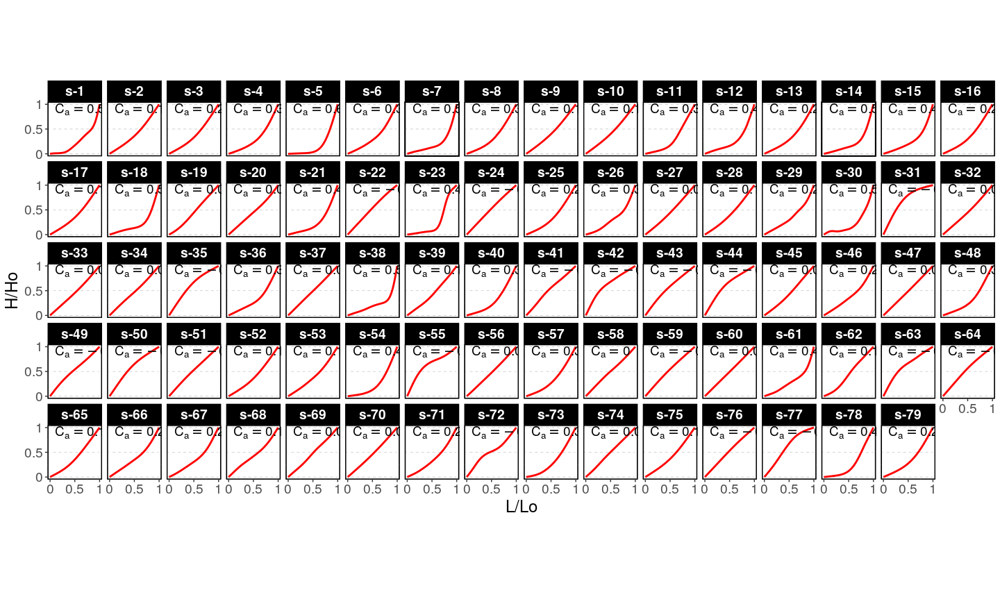{width=70%}
   
   Los parámetros morfométricos que se obtuvieron (ver tabla \ref{tablasiete}) incluyendo coeficiente  de compacidad que indica que la forma de la superficial de la cuenca de acuerdo con su delimitación y el predominio en su escorrentía, es muy alargada; pero tomando en cuenta el parámetro forma de la cuenca genera un índice el cual indica que la cuenca, además de ser muy alargada, es bastante ensanchada por las áreas de cuenca media y cuenca alta.
  
   De los cursos mas largos, se destaca el número 5 (ver figura \ref{mapados}), siendo este meramente el rio cabecera, el rio soco, el cual desemboca en la boca del soco al sur de la cuenca, el curso se mueve englobado de norte a sur, presentando líneas concavas que facilitan su curso, creando meandros en su recorrido, políticamente pasa por 3 provincias, libros del servicio Geológico Nacional del 2019 muestran un cauce formado por piedra caliza y conglomerados, sin presencia de clinoformas, mientras que presenta anchura en su lecho en la parte baja de la cuenca,.
   
  Por otra parte, en los perfiles podemos apreciar varias líneas convexas, contando con  18 redes convexas, de órdenes menores, llámense 2,3,4, en la parte norte de la cuenca y a los alfuentes de los alrededores, la mayoría desde el número 31 en adelante. La razón de bifurcación mostrada en los resultado de la ejecución (ver tabla \ref{tablasiete}), muestrean una constancia en los números y en el área como tal.
  
   También están los cursos casi rectilíneos como son los caso del los cursos numero 24, 37 y 47 con índices de concavidad menores a 0.18, rectilíneos a mas de 50%. la cuencas del soco tiene 461 ríos de órdenes contables, lo que la convierte en una de las cuencas mas grandes e importantes de la nación.(ver tabla \ref{tablauno})

  Table: \label{tablauno} Estadísticas de los ordenes de red de la Cuenca del Soco

| Pedido máximo | Tot.N.str. | Tot.str.len. | Tot.area. | Dr.dens    | Str.freq.   |
|---------------|------------|--------------|-----------|------------|-------------|
| (núm)         | (núm)      | (km)         | (km2)     | (km / km2) | (núm / km2) |
| 5             | 461        | 827.6249     | 988.6235  | 0,8371     | 0.4663      |

   Las estadísticas que son generadas sobre la curva y la integral hipsométrica obtuvieron 75 resultados para los cursos que en red de orden 2 todos con gran similitudes y por lo tanto, pocas diferencias que comentar, todos con curvas moderadas, las cuales muestran un proceso de evolución históricamente/gemorfológicamente normales.(ver tabla \ref{tablaocho} y ver mapa \label{mapados})
   
   Para los cursos de agua que estan asignados en orden número 3 de la cuenca del soco, se produjeron 17 resultados donde los valores mas altos tuvieron cierta evolución en cuanto a elevación se refiere, donde todos se realizaron de forma uniforme y con un poco de elevación media.

# Discusión

  Con  dichos datos anteriormente mencionados, consecuentes a la cuenca del Soco, hemos respondido preguntas planteadas de investigación en marcha sobre que tan lejos esta el inicio de la cuenca, forma de la misma y su red de drenaje, organización de esta y la relacion de los perfiles longitudinales y su índice de de concavidad junto a la litología en la cuenca. Sin embargo,  las preguntas concernientes a la relación de los parámetros de la cuenca con la litología en la cuenca, como la importancia de esta cuenca para el lugar situado, no han han sido respondidas a razón de la falta de información e investigaciones, al pasar de los años no se ha provisto de  información concreta sobre la cuenca del soco. Tal es que la información encontrada fue sobre la Boca del Soco dada por el Servicio Geologico Nacional.
  
  La cuenca tiene forma de triangulo isosceles invertido, y la forma de la red de drenaje es dendrítrica. Dicha cuenca produce esta forma en zonas de relieve notoriamente heterogeneo, como se presenta la parte de cuenca alta; los cursos de agua van desarrollandose libremente y no van dependiendo de un control estructural. Es normal en los ordenes de red de las cuencas, desde el orden 1 al orden 5, principalmente en las de orden 5, tipos de rocas y relieve mas heterogeneo, producto al arrastre de la escorrentía desde afluentes a este mas arriba. 
  
  Según estudiosos como Summerfield, explican que la razon de bifurcación que se encuentra entre 3 y 5, da a lugar que la litología del área es semi homogenea. en la tabla \ref{tablasiete}  son visibles los valores ciertamente dentro del mismo rango. Notese como los ordenes 1,2,3 y 4, mantienen cierta homogeniedad en la litología.
 
  Table: \label{tablasiete}Razones de los parametros hidrograficos segun su orden de red.

Order | Bif.rt. | Len.rt. | Area.rt. | Slo.rt. | Grd.rt. | d.dens. | str.freq.
|-----|---------|---------|----------|---------|---------|---------|---------|
    1 |  4.8667 |  2.7139 |   0.0000 |  1.6406 |  1.6100 |  0.6762 |  0.6175 |
    2 |  4.6875 |  2.0492 |   5.1588 |  1.6358 |  2.0326 |  0.3557 |  0.1197 |
    3 |  4.0000 |  2.0396 |   4.0855 |  1.2922 |  1.6364 |  0.1784 |  0.0293 |
    4 |  4.0000 |  4.6611 |   4.6057 |  0.8313 |  2.0090 |  0.0790 |  0.0064 |
    5 |  0.0000 |  0.0000 |   6.2588 |  0.0000 |  0.0000 |  0.0588 |  0.0010 |
    
  Los cursos fluviales mas largos de la orden de red encontrados en en análisis de la cuenca del soco fueron los: 5, 7, 23, 14, 25 y 40, dichos cursos no se encuentran registrados con nombres directos según lo investigado en otras fuentes. Sí conocemos que está el rio Soco, Rio cabecera de la cuenca, siendo este el curso fluvial numero cinco con alrededor de 61 km de largo, desembocando en la boca del soco, donde termina la cuenca. Cabe destacar que esta boca tiene costas de manglares hasta su llegada a la playa, observadas presencialmente desde el puente que cruza el río.
  
   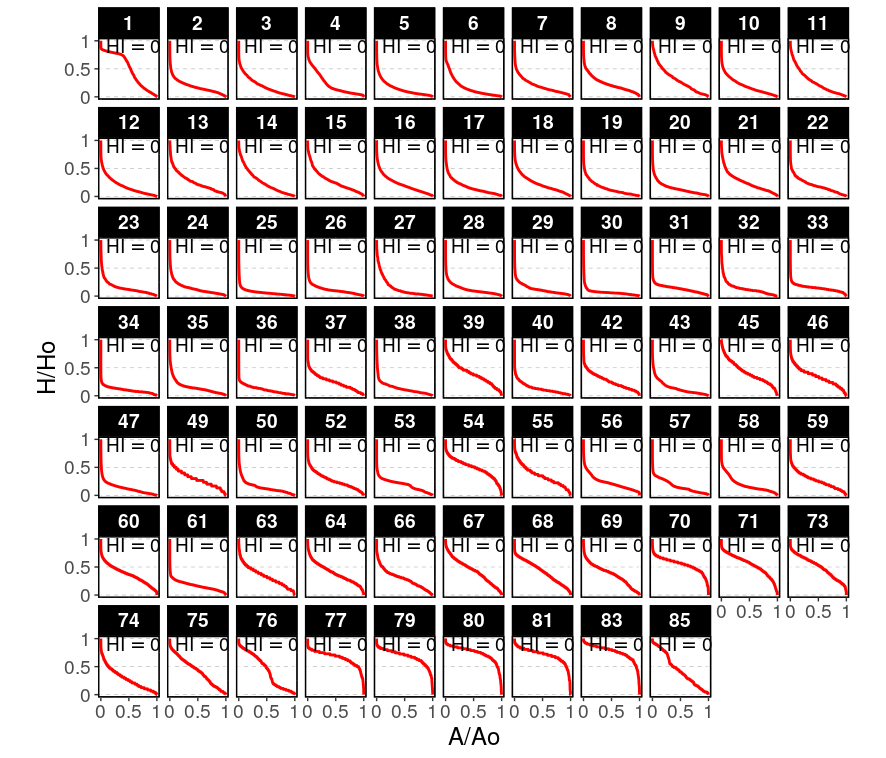{width=70%} 
   
  Comparando los resultados de la vectorial (ver tabla \ref{tablauno}) y el que se obtuvo con r. basin (ver tabla \ref{tablaocho}), el curso mas largo es el numero 5, obtenido gracias a la función lfpNetwprk. Por lo que gracias a la confirmación doble notamos que el río Soco es el curso mas largo de la cuenca en cuestión.
 

Table: \label{tablaocho}Integral Hipsometrica en las cuencas de Orden 2

| ord | cat| Int. Hipso|
|-----|----|-----------|
| 1   | 1  | 0.48838926|
| 2   | 2  | 0.18193323|
| 3   | 3  | 0.19445524|
| 4   | 4  | 0.21762542|
| 5   | 5  | 0.14295602|
| 6   | 6  | 0.15991775|
| 7   | 7  | 0.19598821|
| 8   | 8  | 0.22972788|
| 9   | 9  | 0.29999456|
| 10  | 10 | 0.19312651|
| 11  | 11 | 0.26362902|
| 12  | 12 | 0.18092041|
| 13  | 13 | 0.25637129|
| 14  | 14 | 0.25578278|
| 15  | 15 | 0.27399930|
| 16  | 16 | 0.21718352|
| 17  | 17 | 0.16731969|
| 18  | 18 | 0.22313861|
| 19  | 19 | 0.14558501|
| 20  | 20 | 0.14253386|
| 21  | 21 | 0.24687863|
| 22  | 22 | 0.19453870|
| 23  | 23 | 0.14312417|
| 24  | 24 | 0.13588177|
| 25  | 25 | 0.06656511|
| 26  | 26 | 0.10905142|
| 27  | 27 | 0.14094699|
| 28  | 28 | 0.11947547|
| 29  | 29 | 0.12154615|
| 30  | 30 | 0.06694574|
| 31  | 31 | 0.12986863|
| 32  | 32 | 0.13214347|
| 33  | 33 | 0.14299769|
| 34  | 34 | 0.10321406|
| 35  | 35 | 0.14836356|
| 36  | 36 | 0.10991497|
| 37  | 37 | 0.24081809|
| 38  | 38 | 0.12914719|
| 39  | 39 | 0.38783102|
| 40  | 40 | 0.13000859|
| 41  | 42 | 0.25771843|
| 42  | 43 | 0.13739951|
| 43  | 45 | 0.41175533|
| 44  | 46 | 0.33664967|
| 45  | 47 | 0.12660206|
| 46  | 49 | 0.29142210|
| 47  | 50 | 0.14173861|
| 48  | 52 | 0.26207370|
| 49  | 53 | 0.18704006|
| 50  | 54 | 0.48698763|
| 51  | 55 | 0.34952735|
| 52  | 56 | 0.22693968|
| 53  | 57 | 0.16492509|
| 54  | 58 | 0.18884589|
| 55  | 59 | 0.26409218|
| 56  | 60 | 0.36586150|
| 57  | 61 | 0.16777662|
| 58  | 63 | 0.33413105|
| 59  | 64 | 0.38969687|
| 60  | 66 | 0.28774555|
| 61  | 67 | 0.43177657|
| 62  | 68 | 0.41594979|
| 63  | 69 | 0.36691619|
| 64  | 70 | 0.54537122|
| 65  | 71 | 0.54050406|
| 66  | 73 | 0.50115083|
| 67  | 74 | 0.28375791|
| 68  | 75 | 0.41880781|
| 69  | 76 | 0.43451360|
| 70  | 77 | 0.65887177|
| 71  | 79 | 0.68029357|
| 72  | 80 | 0.73798593|
| 73  | 81 | 0.70710689|
| 74  | 83 | 0.76043899|
| 75  | 85 | 0.44416178|

  En el área de La curva y la integral hipsométrica se muestra una repartición de elevaciones de la cuenca [@jose_ramon_martinez_batlle_2021_4425878], el valor minimo generado para la integral hipsométrica fue de 0.04. en los cursos mas curvos tenemos a los números 30 a 35 (ver tabla \ref{tablados}). Los cursos 73 y 75 son los mas rectilineos y su integral hipsométrica es moderada por lo que estos cursos han experimentado una evolución lenta en su elevación.(ver tabla \ref{mapados})
 
  Los cursos propios de la orden de red 3, el curso de mayor valor numérico (16) muestra una inestable evolución y elevación (ver tabla \ref{mapacuatro})
  
  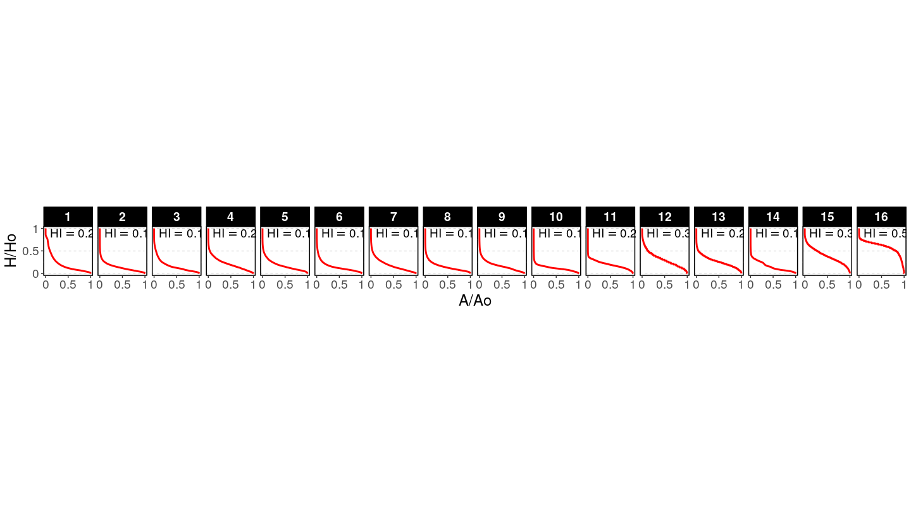{width=70%}

El orden estructurado de la cuenca muestra una afirmacion a la pregunta sobre la estructura de ordenes de la cuenca del soco, se concluye que es posible colocar una represa pequeña dedicada a la producción de electricidad, siempre y cuando se sitúe en área de pendiente semi inclinada y en el río cabecera, convenientemente en una de sus confluencias mas cercanas a la desemmbocadura, ya que la pendiente creada desde la cordillera Oriental llevando aguas a la Llanura Costera del Caribe, crea una fuerte escorrentía aprovechable.
 
  La cuenca del Soco tiene otras ventajas importantes las cuales se relaciónan al terreno, y cabe destacar que los terratenientes de esas areas no suelen utilizar aguas del río para abastecimiento.
 
  Aunque no se pudo hacer una comparación concreta de información obtenida en el uso de software libre de la cuenca del soco con otras fuentes, el uso de las mismas fue usado de forma cuantitativamente productiva. Cabe destacar que toda esta información ha servido como puerta a investigaciones futuras sobre morfometría fluvial en el país.
  
  Esto crea esperanzas de nuevas investigaciones cercanamente futuras y ayuda al desarrollo informativo de la Geografia Dominicana, siendo un reto para el estudio de movimientos geomorfologicos futuros siendo comparados con los datos de esta investigación.

# Agradecimientos

  A Dios, por otorgar las fuerzas necesarias para realizar lo visto
  
  Al M.A. Jose Ramon Martinez Batlle, por su paciencia y dedicación al enseñar con la intención de dejar una marca inolvidable en mi mente.
  
  A mis padres, Angel Maria de la Rosa (Wilden) por enseñarme sobre redacción y Maireny Esmeralda Caraballo Jimenez, por sus consejos y ánimos
  
  A mi hermano, Isaias De La Rosa.
  
  A mi mismo, por la fuerza de lo voluntad que gracias a Dios poseo.

# Información de soporte

Table: \label{tablados}Tasas de transmisión basadas en el coeficiente de regresión  

| Bif.rt. | Len.rt. | Area.rt | Slo.rt. | Grd.rt. |
|---------|---------|---------|---------|---------|
| 4,3627  | 2,5513  | 4.8325  | 1,3319  | 1.8136  |

Table: \label{tablatres}Relaciones de flujo promediadas con desviaciones estándar

| Bif.rt. | Len.rt. | Area.rt | Slo.rt. | Grd.rt. |
|---------|---------|---------|---------|---------|
| 4,3885  | 2,8660  | 3,4625  | 1,3500  | 1,8220  |
| 0,4546  | 1,2377  | 2,3496  | 0,3823  | 0,2300  |


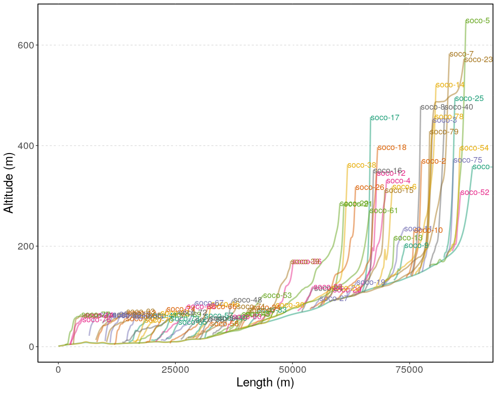{width=50%}

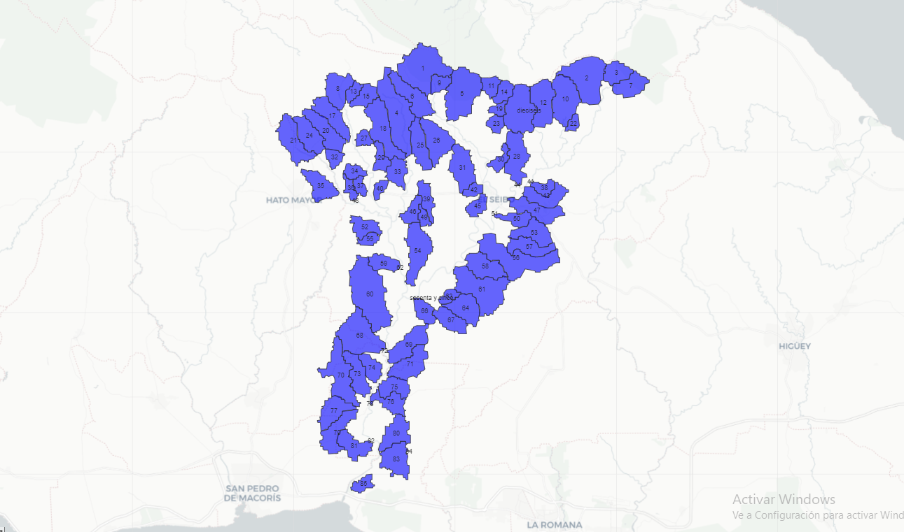{width=70%}

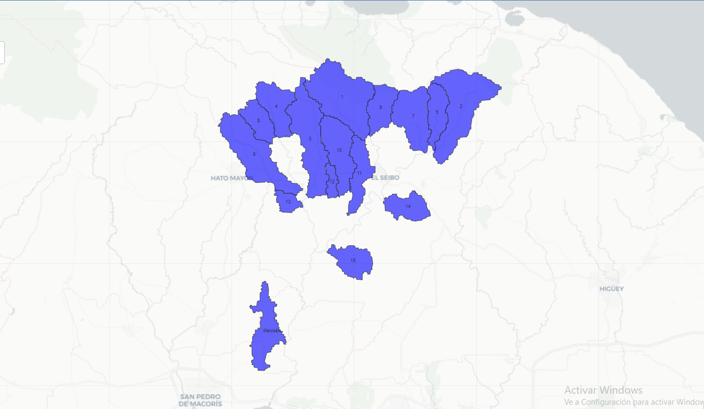{width=70%}

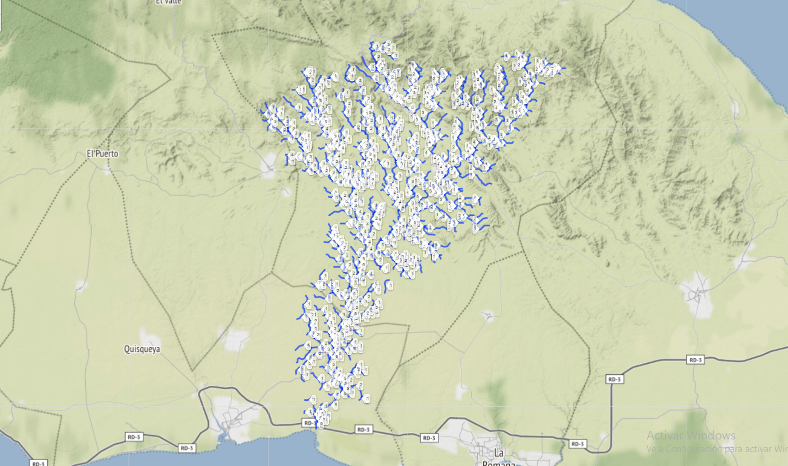{width=70%}


Table: \label{tablacuatro}Variables promediadas para cada orden de red.

| Order  Num  | Avg.len (km) | Avg.ar (km2) | Avg.sl (m/m) | Avg.grad. (m/m) | Avg.el.dif (m) |
|-------------|--------------|--------------|--------------|-----------------|----------------|
| 1           | 1.0951       | 1.6194       | 0.0218       | 0.0162          | 17.6603        |
| 2           | 2.9720       | 8.3544       | 0.0133       | 0.0100          | 33.2667        |
| 3           | 6.0900       | 34.1317      | 0.0081       | 0.0049          | 31.2500        |
| 4           | 12.4215      | 157.2015     | 0.0063       | 0.0030          | 38.2500        |
| 5           | 57.8980      | 983.8981     | 0.0076       | 0.0015          | 87.0000        |


Table: \label{tablacinco}Desviación estandar para las estadísticas según orden de red


| Order  Num  | Std.len (km) | Std.ar (km2) | Std.sl (m/m) | Std.grad (m/m) | Std.el.dif (m) |
|-------------|--------------|--------------|--------------|----------------|----------------|
| 1           | 0.8702       | 1.0490       | 0.0234       | 0.0174         | 21.0933        |
| 2           | 2.3431       | 5.3580       | 0.0083       | 0.0076         | 47.5177        |
| 3           | 4.2366       | 19.5514      | 0.0029       | 0.0023         | 20.9269        |
| 4           | 7.8694       | 72.9224      | 0.0004       | 0.0005         | 8.2297         |
| 5           | 0.0000       | 0.0000       | 0.0000       | 0.0000         | 0.0000         |


Table: \label{tablaseis}Razones de los parámetros hidrográficos según el orden de red


Order  | N.streams | Tot.len (km) | Tot.area (km2)|
|------|-----------|--------------|---------------|
|    1 |       365 |     399.7040 | 591.0968      |
|    2 |        75 |     222.8964 | 626.5809      |
|    3 |        16 |      97.4407 | 546.1068      |
|    4 |         4 |      49.6858 | 628.8060      |
|    5 |         1 |      57.8980 | 983.8981      |


Table: \label{tablanueve}Integral Hipsometrica en las cuencas de orden 3

|ord |cat |Int. Hipso |
|----|----|-----------|
| 1  |   1| 0.1969233 | 
| 2  |   2| 0.1351459 | 
| 3  |   3| 0.1620187 | 
| 4  |   4| 0.2090313 |  
| 5  |   5| 0.1767976 | 
| 6  |   6| 0.1462086 | 
| 7  |   7| 0.1822861 | 
| 8  |   8| 0.1504306 | 
| 9  |   9| 0.1708137 | 
| 10 |  10| 0.1184473 | 
| 11 |  11| 0.1967438 | 
| 12 |  12| 0.3106096 | 
| 13 |  13| 0.2661533 | 
| 14 |  14| 0.1557006 | 
| 15 |  15| 0.3884555 | 
| 16 |  16| 0.5907859 | 


Table: \label{tablanueva} Herramientas utilizadas para el Análisis

|           Materiales          	|                                                                                                                      Uso                                                                                                                     	|
|:-----------------------------:	|:--------------------------------------------------------------------------------------------------------------------------------------------------------------------------------------------------------------------------------------------:	|
|            RStudio            	| Redacción del manuscrito, procesamiento de datos extraídos del MDE de la cuenca a través de un script.                                                                     	|
|        library rgrass7        	| Creación de interfaz que establecer conexión entre la version 7 del sistema de infromacion geográfica GRASS y R, que crea un entorno GRASS desechable dentro de R.                                                                   	|
|           library sp          	| Importación, manipulación y exportación de datos espaciales en R, e impresión de los mismos.                                                                            	|
|           library sf          	| Creación de caracteristicas simples (simple features), que amplían los objetos tipo data.frame con una columna de lista de características simples.                                                                                                 	|
|         library raster        	| Manipulación de datos geográficos (espaciales) en formato 'ráster'.                                                                                                                               	|
|        library leaflet        	| Representación de los vectores y rásters.                                                                        	|
|         library leafem        	| Proveedor de extensión para leaflet usados para paquetes mapview, permitió mostrar las coordenadas de la posición del puntero del mouse. 	|
|        library mapview        	| Permitió ver los objetos espaciales de forma interactiva.                                                                                                                                                       	|
|         library readr         	| Lector de datos rectangulares (como 'csv', 'tsv' y 'fwf').                                                                                                                  	|
|        QGIS with GRASS        	| Visualizador de vectores y rasters generados con RStudio en una región de GRASS, de los mapas Topográfico y Geológico de la República Dominicana, y, también, Creador de mapas de localización. 	|
|          Google Earth         	| Utilizado para observar datos en formato kml generados y exportados de RStudio y asi como para la representación del relieve del lugar de estudio.                                                                                                          	|
                                                                                                                                     	

# *Script* reproducible

````
`r paste(readLines('scrip_reproducible_r_isaac.R'), collapse = '\n')`
````


# Referencias
